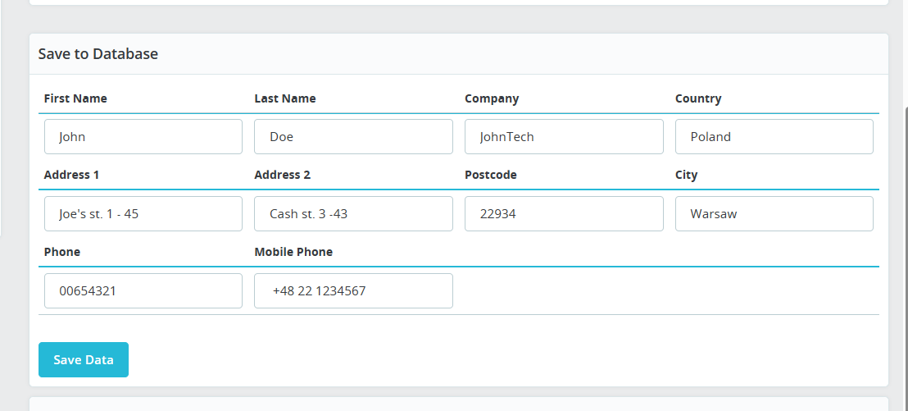
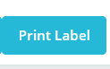

# Carrier Module for PrestaShop

Carrier Module made for PrestaShop to easily print PDF Labels of a given Shipment.

## Features
- DisplayAdminOrderMain Hook
- Create Custom Carrier
- Save Customer's information to the Database
- Generate PDF Label of a given customer
- Automatically Install & Uninstall Carrier on module's Installation and Uninstallation
- Github CI/CD Pipelines (Automatically create .zip Artifact to use in Production)

## Usage
* Information is prefilled already, change it according to your needs

* After information is saved, the "Print Label" button appears

* Press it & PDF file should open in a new tab automatically!

## Getting Started

- Clone repository
```
git clone https://github.com/SteponasK/Prestashop-Shipping.git
```
- Add it to modules folder on a PrestaShop system
- Install module in: Modules -> Module Manager -> Others

### Prerequisites
* Downloaded ERP Repository: [GitHub link](https://github.com/SteponasK/Prestashop-Shipping-ERP)
* Running Symfony Server
* Composer
* PHP >= 8.2
* Prestashop >= 1.7.6.5


# Authors
* SteponasK - Initial Work

## License

This project is licensed under the MIT License - see the [LICENSE](LICENSE) file for details
